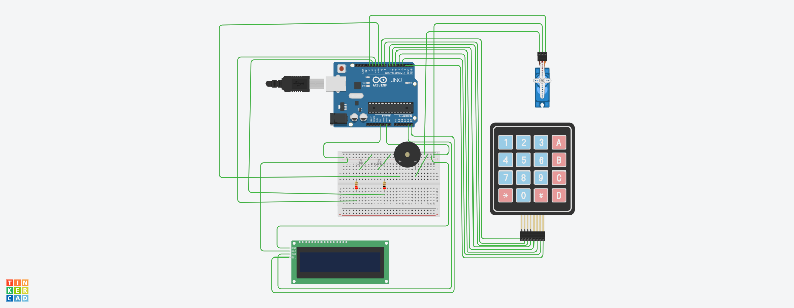

# 🔐 Advanced Door Lock System | Arduino Based

## 🎯 Objective
The objective of this project is to design and implement an **Advanced Security Door Lock System** using **Arduino**.  
The system ensures secure access through **passcode authentication** and provides real-time feedback using an **LCD display, LEDs, buzzer, and a servo-controlled locking mechanism**.

---

## 📌 Project Overview
This project enhances traditional door locking mechanisms by integrating electronic authentication and user interaction.  
A keypad-based interface allows users to lock, unlock, and reset passcodes, while visual and audio indicators provide security alerts and system status.

The system is designed for **home security demonstrations, embedded system projects, and academic applications**.

---

## 🛠 Hardware Components Used

| Component | Quantity |
|----------|:--------:|
| Arduino Board | 1 |
| 4×4 Matrix Keypad | 1 |
| 16×2 LCD Display | 1 |
| Servo Motor | 1 |
| Red LED | 1 |
| Green LED | 1 |
| Buzzer | 1 |
| Resistors | 2 |
| Breadboard | 1 |
| Jumper Wires | As required |

---

## 🧾 System Description

### Input & Output Devices
- **Keypad** → Used for passcode entry and system navigation  
- **LCD Display** → Displays instructions, alerts, and system status  
- **Red LED** → Indicates locked state  
- **Green LED** → Indicates unlocked state  
- **Buzzer** → Audible alert for security violations  
- **Servo Motor** → Controls door lock movement  

---

## 🖥️ System Startup
On power-up, the LCD displays:

➡ **“Enter # or * or A”**

This allows the user to select different operating modes using the keypad.

---

## ⌨️ Keypad Functions

| Key | Function |
|----|----------|
| `*` | Display project information and function list |
| `#` | Enter passcode to lock or unlock door |
| `A` | Reset existing passcode |
| `B` | Backspace (delete last digit) |
| `C` | Clear entire passcode input |
| `D` | Return to Home Screen |
| `0–9` | Passcode digits |

---

## ⭐ Description Mode (`*` Key)
When the `*` key is pressed, the LCD displays:
- Project title  
- Team member details  
- Description of keypad functions  

This mode helps users understand system operation.

---

## 🔓 Door Lock / Unlock Mode (`#` Key)

### ✔ Correct Passcode
- LCD displays **“CORRECT PASSCODE”**
- Servo motor unlocks the door
- Red LED turns OFF
- Green LED turns ON
- LCD displays **“DOOR UNLOCKED”**

### ❌ Incorrect Passcode
- Maximum **3 attempts allowed**
- After 3 failed attempts:
  - Buzzer sounds for **10 seconds**
  - LCD displays **“SECURITY ALERT”**
  - System returns to Home Screen

---

## 🔁 Passcode Reset Mode (`A` Key)

### ✔ Correct Old Passcode
- User is prompted to enter a new passcode
- LCD displays **“New Passcode Changed Successfully”**

### ❌ Incorrect Old Passcode
- Buzzer sounds for **5 seconds**
- LCD displays **“SECURITY ALERT”**
- System returns to Home Screen

---

## ⚠️ Limitations
- Any user knowing the correct passcode can unlock the door
- Biometric authentication (fingerprint) is not implemented due to hardware constraints
- Security depends on mechanical strength of servo-based locking
- No remote monitoring or logging of access attempts

---

## 🔌 Circuit Diagram

  
   <b>Advanced Door Lock System – Circuit Diagram</b>

---

## 🚀 Future Enhancements
- Fingerprint-based secondary authentication  
- IoT-based remote lock monitoring  
- Mobile application control  
- Automatic door re-lock timer  
- Camera capture on multiple failed attempts  

---

## 📄 Project Details
- Platform: **Arduino**
- Programming Language: **Embedded C / Arduino**
- Interface: **Keypad + LCD**
- Application Domain: **Embedded Systems / Security Systems**

---

## 📜 License
This project is intended for **educational and academic purposes**.  
Users are free to modify and extend the system for personal or learning use.

---

### ⭐ If you find this project useful, consider starring the repository!
